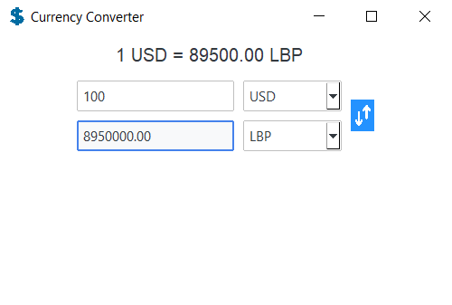

# Currency Converter
A Python-based currency converter with a modern GUI built using ttkbootstrap. Features include real-time exchange rates, dynamic updates, a convenient currency swap button, and a responsive, user-friendly design.

## Features

- Real-Time Currency Conversion: Converts entered amounts using live exchange rates retrieved via API.
- Swap Button: A single click swaps the base and target currencies.
- Dynamic Input Handling: Automatically updates converted values as you type in the amount.
- Modern User Interface: Built with ttkbootstrap for a sleek and responsive design.

## Screenshots

    &nbsp;&nbsp;&nbsp;&nbsp;&nbsp;
    

    &nbsp;&nbsp;&nbsp;&nbsp;&nbsp;
    

## Instalation (Create Standalone Executable)
It is assumed that Python and pip are installed on your system.

Follow these steps to set up and run the **Currency Converter** on your computer:

1. Download the repository as a zip file and unzip it.
2. Open your terminal or command prompt and navigate to the currency converter directory by typing `cd path/to/your/directory/currency-converter-main`.
3. In the command prompt now type `pip install -r requirements.txt` to download the required packages.
4. Now you should type `pyinstaller --onefile --noconsole --add-data "assets/icon.png;assets" --add-data "assets/icon.ico;assets" --hidden-import "ttkbootstrap" --icon "assets/icon.ico" --distpath . "Currency Converter.py" & rmdir /s /q build & del "Currency Converter.spec"` to install the currency converter as a standalone executable.
4. Now the Currency Converter.exe file should be in currency-converter-main and you can run it.

## Troubleshooting
- **Add PyInstaller to PATH**: If you encounter the error `'pyinstaller' is not recognized as an internal or external command, operable program or batch file`, you need to add the PyInstaller directory to your system's PATH.
- **Missing Dependencies**: If the application fails due to missing dependencies, ensure all packages in `requirements.txt` are installed. Run `pip list` in the command prompt.
- **Windows antivirus**: If Windows antivirus blocks pyinstaller from turning the code into a standalone excecutable: Click the popup "Allow on device", then "Start action".

## File Structure
- **Currency Converter.py**: Entry point to run the application.
- **gui.py**: Defines the graphical user interface.
- **converter.py**: Contains core logic for currency converter and functionality.
- **api.py**: Retrives a touple from the API that contains all the live currency data.
- **assets/**: Directory for resources like the application icon.
